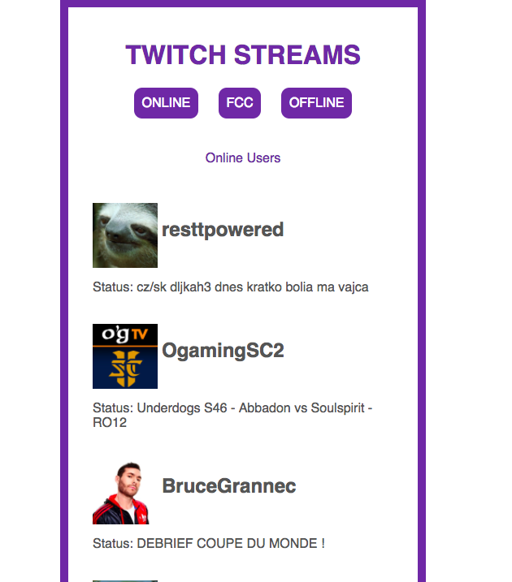

# twitch-json
A small app that connects to Twitch's API to check a set list of users to let you know if they're currently streaming or not.

So the point of this project wasn't really about getting used to Twitch's API. It was mostly just about getting used to working with the JSON data that gets returned from an ajax response and how to pull pieces of information out of the JSON object. Basically, there are three main functions in this project. The online button makes an ajax request to Twitch's api that checks to see whether or not any of the users in my follows array is currently online or not. If they are online, then return the information back about those people to the screen. And the same goes for the Freecodecamp button and the offline button.

When the app first loads however, I'm checking to see who, from my follows array, is currently online or offline.

    //display all online users on load
    for (var i = 0; i < follows.length; i++) {
        $.ajax({
            type: 'GET',
            url: streamUrl + follows[i],
            headers: {
                'Client-ID': 'st6lldhb71xn0r3v17erqj9d715fz3m'
            },
            success: function(data) {
                if (data.stream == null) {
                    //find username if user is not online
                    user = data._links['channel'].substr(38);
                    if (user === 'FreeCodeCamp') {
                        fccUser = false;
                    }
                    offline.push(user);
                } else {
                    user = data.stream.channel.display_name;
                    //if user is online push that data into online array
                    online.push(user);
                    var name = data.stream.channel.display_name;
                    var logo = data.stream.channel.logo;
                    var url = data.stream.channel.url;
                    var status = data.stream.channel.status;
                    panels.append("

<a href=" + url + " target='_blank'><h2 class='name'>" + name + "</h2></a>

Status: " + status + "

");
                }

            }

        });
    }
    
    if the user is not online, they are pushed into a global offline array. If they are online then they'll be displayed on the screen and if they are fcc, then that user will be stored in the fccUser variable. I guess in hindsight, one way I could make this code cleaner, is to just create an array of objects for offline, online and the fcc User objects. But instead in this current iteration, I opted to just store the string name of the user if they are not online into the offline array. I think doing something like adding all the objects of data into their correct array would be a much smarter way to handle this project mostly because I don't have to make as many ajax requests. So we'll see if I end up doing that in another TODO later on.

